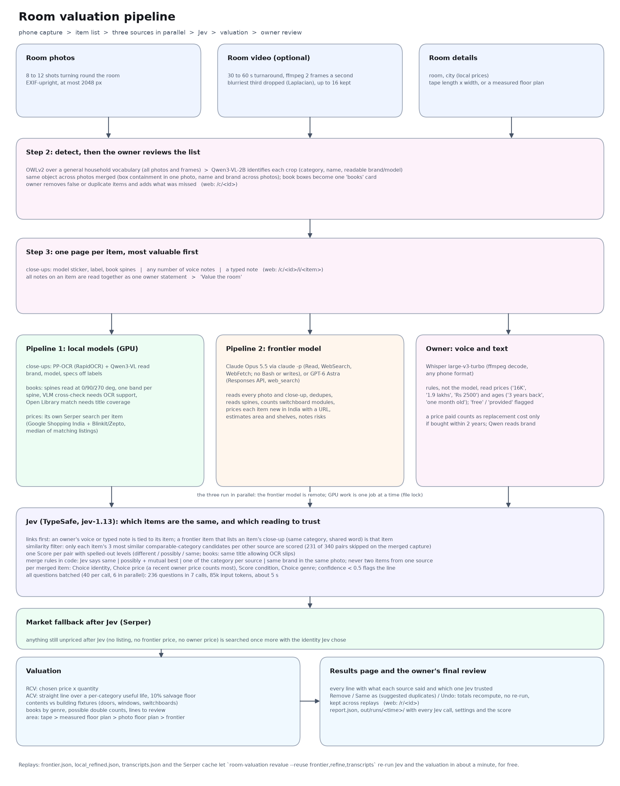

# How the pipeline works



The diagram is drawn by `scripts/draw_pipeline.py`; rerun it after changing the pipeline.
Numbers below are from the merged bedroom capture (`docs/results/bedroom-merged`).

## 1. Capture (phone, `web/index.html`, `web/record.html`)

- The owner gives photos, a video, or both, plus room details: room name, city, and tape
  dimensions if known.
- Photos are EXIF-upright and at most 2048 px.
- A video goes through `run.video_frames`:
  1. ffmpeg takes 2 frames a second.
  2. The blurriest third is dropped (variance of the Laplacian).
  3. At most 16 frames are kept, evenly spaced.
  4. They are used exactly like photos.
- The merged bedroom had 8 photos and 16 frames.
- The capture is stored under `data/captures/<id>/`: `meta.json`, `photos/room/`, `video.*`,
  `session.json`.

## 2. Detection and the owner's list (`local.detect`, `web/items.html`)

1. **OWLv2** (`google/owlv2-base-patch16-ensemble`) runs over each photo with a general
   household vocabulary of about 60 prompts. Nothing is tuned to one room.
2. Boxes go through NMS, tiny boxes are dropped, and at most 14 are kept per photo.
3. **Qwen3-VL-2B** looks at each crop and returns category, name, readable brand/model,
   size, printed text and condition. Answers that repeat the prompt's example are dropped
   (see section 9).
4. The same object in several photos becomes one item:
   - within one photo: box containment above 0.45
   - across photos: same brand, or similar names
5. Book boxes become one "books" card. Its spines are read in step 4, not from the crop.
6. The owner sees the list with counts per type, removes false or duplicate items, and adds
   anything missed. This is stored in `session.json`.

## 3. One page per item (`web/item.html`)

Items are walked through most valuable first (laptop, monitor, appliance, furniture, books,
and so on). Each page takes:
- **close-ups:** a model sticker, a rating plate, spines, the screen showing its resolution
- **any number of voice notes** (`items/<id>/voice_NN.*`)
- **a typed note**

All notes on an item are read together as one owner statement. Uploads retry if the server
is briefly unavailable.

## 4. Three sources, in parallel (`run.value`)

The frontier model is remote and runs in its own thread. The GPU work (local models,
Whisper) runs under a file lock, one job at a time across processes: two jobs on the 8 GB
card once crashed one of them.

### Pipeline 1: local models (`local.refine`, `local.price_all`)

- **Close-ups:**
  - PP-OCR reads every line of text on the label. These are PaddleOCR's PP-OCRv6 models run
    through RapidOCR on ONNX Runtime, because PaddlePaddle has no Python 3.14 build.
  - Qwen3-VL reads brand, model, size and specs, given the OCR text as a hint.
- **Books** (`local._read_spines`):
  - One full-resolution crop per photo around all book boxes, or the spine close-ups.
  - PP-OCR reads at 0, 90 and 270 degrees. The rotation where the text lies flat wins, and
    lines are grouped into one band per spine.
  - Qwen reads the spines too. A title that only Qwen claims must have half its words
    supported by the OCR text; this stopped "Anne of Green Gables" appearing.
  - Each spine text goes to Open Library. A match is accepted only if half string similarity
    plus half title coverage reaches 0.6; this stopped "The *Slender* Thread". Summaries and
    study guides are skipped.
  - Unmatched text that shares a word with a matched book is a partial read and is dropped.
    What is left becomes an "unidentified book", priced at the room's median book.
- **Prices: pipeline 1 gives its own value for every item**, as the brief asks ("get the
  local price of the books… categorize… by their value. This is one pipeline"). That way Jev
  has two independent market values to rank, plus the owner's.
  - One Serper search per item, from this pipeline's own reading (`prices.query_for`):
    - repeated words are dropped ("Acer" plus "Acer 24 inch monitor" says Acer once)
    - vague one-word names get a category word ("switch" becomes "switch electrical wall",
      after "switch" matched Nintendo Switch listings)
    - books search "title author paperback"
  - Sources:
    - Serper Google Shopping for India (Amazon.in, Flipkart, Croma, Reliance, Zepto appear
      as sellers)
    - a Google site search of blinkit.com and zeptonow.com for small goods
  - Only listings whose titles share at least half the query words, and the brand, count.
    The median of those is the price.
  - An unreadable spine gets the median of the identified books.
  - Every query is cached in `data/price_cache/`.

### Pipeline 2: frontier model (`frontier.run_opus`, `frontier.run_astra`)

- Claude Opus 5.5 runs through `claude -p` with Read, WebSearch and WebFetch. Bash, Edit and
  Write are disallowed.
- It gets every photo, each tagged "room" or "close-up of the <item>", and one prompt asking
  for:
  - a deduplicated inventory
  - spine titles and genres
  - switch, socket and regulator counts per switchboard
  - doors and windows as building fixtures
  - a new price in India per item, with the URL it came from
  - condition, room area, shelf count, and notes for the insurer
- On the merged capture: 43 items in 306 s, reported as $3.23 of usage by `claude -p`.
- The raw output is kept in `out/opus_raw.json`.
- `run_astra` is the same prompt through the OpenAI Responses API with `web_search`
  (`gpt-6-astra`). It is written but untested, because the key had no credits.

### Owner: voice and text (`voice.run_items`)

- Whisper large-v3-turbo transcribes each note. ffmpeg decodes it to 16 kHz mono first,
  because Chrome records webm and iPhones record m4a.
- **Prices and ages are read by rules** (`voice.parse_price`, `parse_age`), not by a model:
  - prices: "16K", "1.9 lakhs", "Rs. 2500", "500 rupees"
  - ages: "3 years back", "one month old", "last year"
  - Qwen 2B had invented a ₹12,000 charger and read "40 years back" as one year.
- "Came free" or "company provided" is flagged, and ₹0 is never a price.
- A price paid is a replacement-cost candidate only if the purchase was within 2 years. The
  ₹450 paid for a 35-year-old bed says nothing about replacing it.
- Qwen reads only the brand from the text.
- Each owner statement is linked to its item (`Item.link`).

## 5. Jev combines the three (`jev.py`)

Jev (TypeSafe, `jev-1.13.0`) answers typed questions with probabilities and a confidence.
As its docs advise, it only judges; counting, thresholds and arithmetic stay in code.

1. **Links before any guessing:**
   - An owner note joins its item.
   - A frontier item that lists an item's close-up among its photos is that item, if it is
     the same category and shares a word with the item's name. A door in the background of
     the chair's close-up is not the chair.
2. **Similarity filter:**
   - Only pairs of comparable categories are considered. Bedding and furniture are
     comparable, since a bed was filed under both. Building fixtures are never compared
     across categories.
   - Only each item's 3 most similar candidates in each other source are scored.
   - On the merged capture: 109 pairs scored, 231 skipped.
3. **One Score per pair.** The levels are spelled out, because Jev reads literally; a misread
   model name once made it call one laptop two.

   ```
   instructions: {item_a: {laptop, HP, "Vergence", 14 in, photos f1 f2 f3},
                  item_b: {HP Victus 15, 15.6 in, photos f1 f2 f3},
                  question: "Do item_a and item_b describe the same physical object in this room?"}
   criteria:     ["different objects: a different kind, a different brand, or a clearly different item",
                  "possibly the same object, not sure",
                  "the same physical object: same kind and brand, or seen in the same photos;
                   small differences in model name, size, colour or wording are misreadings"]
   ```

   Books get their own levels: the same title, allowing OCR slips and words run together.
4. **Merge rules, in code** (`jev._merge_scored`). A group never holds two items from the
   same source. Pairs merge when:
   - the score is 1.5 or more (Jev says the same object)
   - the score is 0.75 or more and each item is the other's best match
   - each source has exactly one item of this category, unless Jev is confident they
     differ
   - each source has exactly one item of this category, with the same brand, in the same
     photo

   Anything else near a match is flagged as a possible double count.
5. **Per merged item:**
   - a Choice picks which reading identifies it
   - a Choice picks which price to trust
   - a Score gives its condition
   - a Choice gives the genre for books

   Real example from the merged run, for the laptop's price:

   ```
   candidates: local    Rs 77,245  median of 18 listings for 'HP VICTUS 14 inches laptop'
               frontier Rs 78,858  exact SKU not readable
               voice    Rs 1,90,000  what the owner says they paid, 0.08 years ago
   how_to_judge: "A price the owner paid within the last 12 months for this exact item is the strongest evidence ..."
   answer: voice, probabilities {voice 0.69, local 0.29, frontier 0.02}, confidence 0.53
   ```

   Confidence under 0.5 flags the line for review.
6. **Batching:** 40 questions per call, 6 calls in parallel. On the merged capture that was
   236 questions in 7 calls, 85k input tokens, about 5 s and well under a cent. Every call
   (state, questions, answers, model, usage) is kept in `out/runs/<time>/jev_calls.jsonl`.

## 6. Market prices after Jev, for what is still unpriced (`market.py`)

Jev has ranked the three price sources: pipeline 1's search, the frontier model's web price,
and the owner's price from within 2 years. A merged item can still have no price at all:
- the local search found no matching listing
- the frontier model missed the item
- the owner said nothing about it

Each such item is searched once more, with the identity Jev chose (usually a better query than
the local reading), and the result joins as a **market** candidate. An unreadable book gets the
room's median book price.

**Why both.** At first Serper ran only after Jev, and pipeline 1 gave no prices. That scored
worse, and it departs from the brief, where pipeline 1 produces values for Jev to rank against
Astra's. Replayed on the three saved captures (with the earlier Opus pass):

| Capture | Mean RCV error on recent purchases, Serper only after Jev | Both |
|---|---|---|
| merged | 10.6% | 10.0% |
| video | 13.8% | 10.6% |
| photos | 31.0% | 31.0% |

With three candidates, Jev picked the owner's price for the AC (₹35k) and the table (₹8k),
where it had picked the frontier's before. The after-Jev search then had nothing left to do on
two captures and one item on the third.

## 7. Valuation (`valuation.py`, `prices.acv`, `area.py`)

- **RCV** is the chosen price times the quantity.
- **ACV** is `RCV x max(0.10, 1 - age / useful life)`:
  - The age comes from the owner, if said. Otherwise the condition stands in for it: like
    new 10% of the life used, good 35%, fair 60%, poor 85%.
  - Useful lives: laptop 5 years, monitor 6, appliance 8, furniture 10, book 10, building
    fixture 30, and so on.
- **Contents** and **building fixtures** (doors, windows, switchboards, the MCB box) are
  totalled apart, because an insurer covers them under different policies.
- **Books** are totalled by genre.
- Lines are flagged when their price confidence is low, a possible double count exists, the
  owner said the item was free or provided, or no source gave a price.
- **Area**, in order of preference:
  1. tape dimensions
  2. a floor plan the floor plan take-home already measured (its ARCore depth tier: 15.68 m²
     against the tape's 15.61 m²)
  3. that pipeline run on these photos (VGGT plus MoGe-2 scale: 11.6 m², too low)
  4. the frontier model's estimate (15.5 m² on the latest pass, 12.5 m² on the one before)

  Every candidate is shown, and the plan picture comes from whichever has one.

## 8. Results and the owner's final review (`web/results.html`)

- Every line shows what each source said and which one Jev trusted, with the photos, the
  candidates, and the Jev probabilities.
- The owner can **Remove** a line, mark it **Same as** another (flagged lines get a suggested
  target), or **Undo**. Totals recompute on the next read, with no re-run.
- Decisions are stored by a stable line key, the sorted member item ids, so they survive
  replays.

## 9. What is saved, and replays

| Artifact | Where | Used for |
|---|---|---|
| Every Serper response | `data/price_cache/*.json` | replays never search twice |
| Market searches after Jev | `out/market_log.json` | which items were searched, with what query |
| Frontier raw output and parsed items | `out/opus_raw.json`, `out/frontier.json` | `--reuse frontier` |
| Local close-up and spine reading | `out/local_refined.json` | `--reuse refine` (no GPU) |
| Transcripts | `out/transcripts.json` | `--reuse transcripts` |
| Report, pair scores, every Jev call, settings, score | `out/runs/<time>/` | comparing settings run against run |
| Frozen real captures | `data/fixtures/` | the tuning loop |

`uv run room-valuation revalue <capture> --reuse frontier,refine,transcripts` re-runs
matching, Jev and the valuation on saved sources in about a minute, for free. Every fix in
the README's tuning table was found and checked this way.

## 10. Known limits

- **Local-only duplicates.** Two lines both from the local detector (a "wardrobe" next to the
  almirah) cannot be merged by Jev, since a group holds one item per source. The owner's
  review catches them.
- **The small VLM copies prompt examples.** On the merged capture the laptop got
  "specs: 1400 W" from the air-fryer example in the close-up prompt. Values equal to a prompt
  example are now dropped. Owner notes and the frontier model outrank the local reading
  anyway.
- **Floor area from phone photos alone is weak** (11.6 m² against 15.6). Use tape
  dimensions or a measured plan.
- **Windows and doors** are the frontier model's supply-plus-install estimates, not
  listings.
- **One room per capture.** A whole house is several captures; there is no roll-up yet.
- **The GPT-6 Astra backend is untested.**
